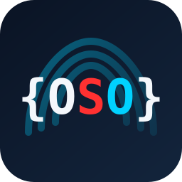

# OpenShellOrg Docs

Documentation hub for https://github.com/openshellorg[OpenShellOrg] — Antora site aggregating org projects, plus SOS certification packages in this monorepo.

<p align="center">
  
</p>

## Mission

Two complementary tracks:

1. **Standardized Operations Syntax (SOS)** — unify human-friendly CLI flag syntax and certify compliant tools (“Save Our Syntax”).
2. **Structured shell architecture** — advocate typed data pipelines (endorse [Nushell](https://www.nushell.sh/)) so stdout is not forced to be both a pipe *and* a display canvas. Do **not** reinvent Nushell; document the model and ship helpers.

SOS remains the certification/flag work in this monorepo. Structured-shell direction lives in sibling repos (below).

## Related projects

| Repo | Role |
|------|------|
| [shell-architecture](https://github.com/openshellorg/shell-architecture) | Thesis and layers: structured I/O, SOS, terminals, Dev-Centr relationship |
| [nu-require](https://github.com/openshellorg/nu-require) | `validate()` — require / relaunch under Nushell; optional install offer |
| [nu-emit](https://github.com/openshellorg/nu-emit) | C-first API to emit structured rows (JSONL) without hand-rolling JSON |

**Name collision:** We are not [NVIDIA OpenShell](https://github.com/NVIDIA/OpenShell) (agent sandbox runtime). Different problem, similar words.

Dev-Centr **recommends/configures** Nushell for developers; OpenShellOrg **standardizes and tools**. Keep the orgs aligned, not merged.

## Repository structure

```
docs/                      # this repo (openshellorg/docs)
├── apps/
│   └── main/              # Main website (SolidStart)
├── docs/                  # Antora hub component (SOS, philosophy, ecosystem)
├── packages/
│   ├── sos-grammar/       # @sos/grammar
│   └── sos-validator-core/
├── assets/brand/
├── antora-playbook.yml    # production (aggregates sibling repos)
├── antora-playbook-local.yml
└── package.json
```

### Apps and packages

| Path | Description |
|------|-------------|
| `apps/main` | Organization website (SolidStart) |
| `docs/` | Hub Antora component (SOS + org pages) |
| `@sos/grammar` | Grammar definitions for parsing SOS syntax |
| `@sos/validator-core` | Core validation logic for SOS compliance |

## Getting started

### Prerequisites

- [Node.js](https://nodejs.org/) (v20+)
- [pnpm](https://pnpm.io/) (v10+)

### Installation

```bash
git clone https://github.com/openshellorg/docs.git
cd docs
pnpm install
```

### Development

```bash
# Apps / packages
pnpm dev
pnpm build

# Docs (Antora)
pnpm docs
# or local sibling checkouts:
pnpm docs:local
```

## Documentation

Published docs: https://docs.opensh.org/

Org site: https://openshellorg.github.io/

## Changelog

See link:CHANGELOG.adoc[CHANGELOG.adoc].

## License

This project is open source. See individual packages for specific licensing information.

---

<p align="center">
  <strong>Save Our Syntax</strong>
</p>
